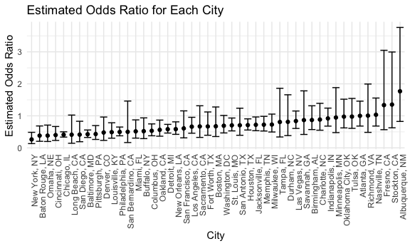
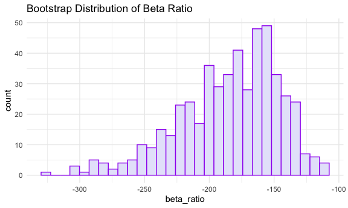
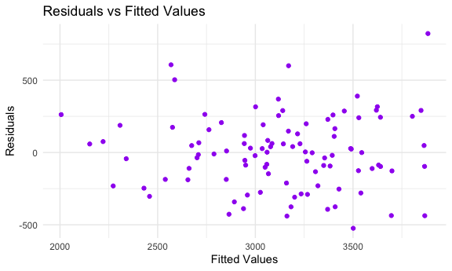

p8105_hw6_nec2159
================
Nicole Criscuolo
2025-11-18

## Problem 1

``` r
homicide_df =
  read_csv("data/homicide-data.csv") |> 
  mutate(
    state = toupper(state),
    city_state = paste(city, state, sep = ", "),
    solved = factor(if_else(disposition %in% c("Closed without arrest", "Open/No arrest"), "No", "Yes")),
    victim_age = as.numeric(victim_age)) |> 
  filter(!city_state %in% c("Dallas, TX", "Phoenix, AZ", "Kansas City, MO", "Tulsa, AL"),
         victim_race %in% c("White", "Black"))
```

    ## Rows: 52179 Columns: 12
    ## ── Column specification ────────────────────────────────────────────────────────
    ## Delimiter: ","
    ## chr (9): uid, victim_last, victim_first, victim_race, victim_age, victim_sex...
    ## dbl (3): reported_date, lat, lon
    ## 
    ## ℹ Use `spec()` to retrieve the full column specification for this data.
    ## ℹ Specify the column types or set `show_col_types = FALSE` to quiet this message.

    ## Warning: There was 1 warning in `mutate()`.
    ## ℹ In argument: `victim_age = as.numeric(victim_age)`.
    ## Caused by warning:
    ## ! NAs introduced by coercion

``` r
baltimore_df =
  homicide_df |> 
  filter(city_state == "Baltimore, MD")
```

``` r
baltimore_model =
  glm(solved ~ victim_age + victim_sex + victim_race, data = baltimore_df, family = binomial)

baltimore_results =
baltimore_model |> 
  broom::tidy(conf.int = TRUE, exponentiate = TRUE) |> 
  filter(term == "victim_sexMale")
```

In homicide cases in Baltimore, MD, male victims had 0.4255117 times the
odds of having their cases solved compared to female victims after
adjusting for age and race. We are 95% confident that the true odds
ratio for male versus female victims is between 0.3241908 and 0.5575508.

``` r
all_city_results =
homicide_df |> 
  nest(data = -city_state) |> 
  mutate(
    fits = map(data, \(df) glm(solved ~ victim_age + victim_sex + victim_race, data = df, family = binomial)),
    results = map(fits, \(x) broom::tidy(x, conf.int = TRUE, exponentiate = TRUE))
  ) |> 
  unnest(results) |> 
  select(city_state, term, estimate, conf.low, conf.high) |> 
  filter(term == "victim_sexMale")
```

    ## Warning: There were 45 warnings in `mutate()`.
    ## The first warning was:
    ## ℹ In argument: `results = map(fits, function(x) broom::tidy(x, conf.int = TRUE,
    ##   exponentiate = TRUE))`.
    ## Caused by warning:
    ## ! glm.fit: fitted probabilities numerically 0 or 1 occurred
    ## ℹ Run `dplyr::last_dplyr_warnings()` to see the 44 remaining warnings.

``` r
all_city_results |> 
  mutate(city_state = reorder(city_state, estimate)) |> 
  ggplot(aes(x = city_state, y = estimate)) +
  geom_point() +
  geom_errorbar(aes(ymin = conf.low, ymax = conf.high)) +
  theme(axis.text.x = element_text(angle = 90, hjust = 1)) +
  labs(
    x = "City",
    y = "Estimated Odds Ratio",
    title = "Estimated Odds Ratio for Each City"
  )
```



After comparing all the cities, NYC is where male homicide victims had
the lowest odds of having their cases solved relative to female victims
after adjusting for age and race. Albuquerque is the city where male
homicide victims had the highest odds of having their cases solved
relative to female victims after adjusting for age and race.

## Problem 2

``` r
data("weather_df")

estimates =
weather_df |> 
  modelr::bootstrap(n = 5000) |> 
  mutate(
    models = map(strap, \(df) lm(tmax ~ tmin + prcp, data = df)),
    tidy_results = map(models, broom::tidy),
    glance_results = map(models, broom::glance),
    beta_ratio = map_dbl(tidy_results, \(tidy_df) {
    (tidy_df |> filter(term == "tmin") |> pull(estimate)) / 
        (tidy_df |> filter(term == "prcp") |> pull(estimate))
    }),
    r_squared = map_dbl(glance_results, "r.squared")
    ) |> 
  select(.id, beta_ratio, r_squared)
```

``` r
estimates |> 
  ggplot(aes(x = beta_ratio)) +
  geom_histogram(fill = "lavender", color = "purple") +
  labs(
    title = "Bootstrap Distribution of Beta Ratio"
  )
```

    ## `stat_bin()` using `bins = 30`. Pick better value with `binwidth`.



The distribution of $\frac{\hat{\beta}_1}{\hat{\beta}_2}$ appears to be
left-skewed. This means there is a larger cluster of ratios on the
higher end, indicating that in many bootstrap samples, ${\hat{\beta}_1}$
tends to be relatively large or ${\hat{\beta}_2}$ tends to be relatively
small compared to their typical values. Intuitively, it is probably more
likely that ${\hat{\beta}_2}$ is more variable than ${\hat{\beta}_1}$
since minimum and maximum temperature are most likely more correlated
than precipitation and maximum temperature.

``` r
estimates |> 
  ggplot(aes(x = r_squared)) +
  geom_histogram(fill = "lavender", color = "purple") +
  labs(
    title = "Bootstrap Distribution of R Squared"
  )
```

    ## `stat_bin()` using `bins = 30`. Pick better value with `binwidth`.


The distribution of $R^2$ appears to be normally distributed and
centered around 0.941. Most estimates are very close to this value,
indicating the proportion of variance explained by the model is high
across bootstrap samples.

In the 5000 bootstrap samples, $\frac{\hat{\beta}_1}{\hat{\beta}_2}$
appears within (-281.7250655, -126.9428924) 95% of the time, and $R^2$
appears within (0.9344706, 0.9465568) 95% of the time.

## Problem 3

``` r
bwt_df =
  read_csv("data/birthweight.csv") |> 
  janitor::clean_names() |> 
  mutate(babysex = case_match(
    babysex,
    1 ~ "male",
    2 ~ "female"),
    babysex = fct_infreq(babysex),
    frace = 
        case_match(frace,
            1 ~ "white",
            2 ~ "black", 
            3 ~ "asian", 
            4 ~ "puerto rican", 
            8 ~ "other"),
    frace = fct_infreq(frace),
    mrace = 
        case_match(mrace,
            1 ~ "white",
            2 ~ "black", 
            3 ~ "asian", 
            4 ~ "puerto rican",
            8 ~ "other"),
    mrace = fct_infreq(mrace),
    malform = as.logical(malform)) |> 
  sample_n(100)
```

    ## Rows: 4342 Columns: 20
    ## ── Column specification ────────────────────────────────────────────────────────
    ## Delimiter: ","
    ## dbl (20): babysex, bhead, blength, bwt, delwt, fincome, frace, gaweeks, malf...
    ## 
    ## ℹ Use `spec()` to retrieve the full column specification for this data.
    ## ℹ Specify the column types or set `show_col_types = FALSE` to quiet this message.

``` r
x = model.matrix(bwt ~ ., bwt_df) [, -1]
y = bwt_df |> pull(bwt)

lambda = 10^(seq(-2, 2.75, 0.1))

lasso_cv =
  cv.glmnet(x = x, y = y, lambda = lambda)

lambda_opt = lasso_cv[["lambda.min"]]
```

``` r
lasso_fit =
  glmnet(x = x, y = y, lambda = lambda_opt)

lasso_fit |> 
  broom::tidy()
```

    ## # A tibble: 5 × 5
    ##   term         step  estimate lambda dev.ratio
    ##   <chr>       <dbl>     <dbl>  <dbl>     <dbl>
    ## 1 (Intercept)     1 -6044.      50.1     0.709
    ## 2 bhead           1   160.      50.1     0.709
    ## 3 blength         1    74.6     50.1     0.709
    ## 4 delwt           1     0.563   50.1     0.709
    ## 5 mraceblack      1    -0.109   50.1     0.709

LASSO was used to build a regression model for birth weight as it
performs variable selection and coefficient shrinkage. The data was
first converted into numerical format with x as the predictors and y as
the outcome. A number of lambda values along with cross validation was
then used to determine the optimal lambda which determines the amount of
shrinkage applied to each coefficient. This is the lambda that was then
used to fit the proposed regression model. Predictors include `bhead`,
`blength`, `delwt`, and `mraceblack`.

``` r
bwt_df =
  bwt_df |> 
  mutate(mraceblack = ifelse(mrace == "black", 1, 0))

lasso_model = lm(bwt ~ bhead + blength + delwt + mraceblack, data = bwt_df)

bwt_df |> 
  add_predictions(lasso_model) |> 
  add_residuals(lasso_model) |> 
  ggplot(aes(x = pred, y = resid)) +
  geom_point(color = "purple") +
  labs(
    x = "Fitted Values",
    y = "Residuals",
    title = "Residuals vs Fitted Values"
  )
```



The residuals versus fitted values plot shows the model is appropriate
because the residuals do not exhibit any pattern and are randomly
scattered around 0.

``` r
main_effects_model = lm(bwt ~ blength + gaweeks, data = bwt_df)
interactions_model = lm(bwt ~ bhead * blength * babysex, data = bwt_df)
```

``` r
cv_df =
  crossv_mc(bwt_df, n = 100) |> 
  mutate(
    train = map(train, as_tibble),
    test = map(test, as_tibble)
  )
```

``` r
cv_df |> 
  mutate(
    lasso_fit = map(train, \(df) lasso_model),
    main_effects_fit = map(train, \(df) main_effects_model),
    interactions_fit = map(train, \(df) interactions_model)
    ) |> 
  mutate(
    rmse_lasso = map2_dbl(lasso_fit, test, rmse),
    rmse_main_effects = map2_dbl(main_effects_fit, test, rmse),
    rmse_interactions = map2_dbl(interactions_fit, test, rmse)
    ) |> 
  summarize(
    pe_lasso = mean(rmse_lasso),
    pe_main_effects = mean(rmse_main_effects),
    pe_interactions = mean(rmse_interactions)
    ) |> 
  knitr::kable()
```

| pe_lasso | pe_main_effects | pe_interactions |
|---------:|----------------:|----------------:|
| 248.6508 |        320.0923 |        244.5633 |

The interactions model has the lowest prediction error, indicating
`bhead * blength * babysex` predicts birth weight the most accurately
compared to the LASSO model and main effects model.
