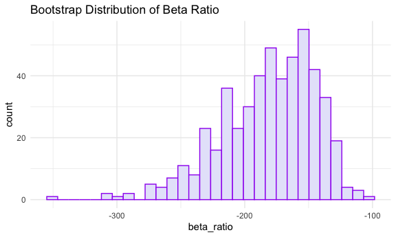
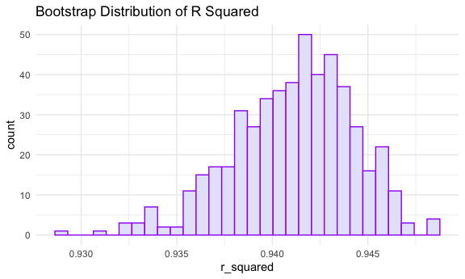

p8105_hw6_nec2159
================
Nicole Criscuolo
2025-11-18

## CHANGE \# BOOTSTRAPS PROBLEM 2

## Problem 2

``` r
data("weather_df")

estimates =
weather_df |> 
  modelr::bootstrap(n = 500) |> 
  mutate(
    models = map(strap, \(df) lm(tmax ~ tmin + prcp, data = df)),
    tidy_results = map(models, broom::tidy),
    glance_results = map(models, broom::glance),
    beta_ratio = map_dbl(tidy_results, \(x) x[["estimate"]][2] / x[["estimate"]][3]),
    r_squared = map_dbl(glance_results, "r.squared")
    ) |> 
  select(.id, beta_ratio, r_squared)
```

``` r
estimates |> 
  ggplot(aes(x = beta_ratio)) +
  geom_histogram(fill = "lavender", color = "purple") +
  labs(
    title = "Bootstrap Distribution of Beta Ratio"
  )
```

    ## `stat_bin()` using `bins = 30`. Pick better value with `binwidth`.



The distribution of $\frac{\hat{\beta}_1}{\hat{\beta}_2}$ appears to be
left-skewed. This means there is a larger cluster of ratios on the
higher end, indicating that in many bootstrap samples, ${\hat{\beta}_1}$
tends to be relatively large or ${\hat{\beta}_2}$ tends to be relatively
small compared to their typical values. Intuitively, it is probably more
likely that ${\hat{\beta}_2}$ is more variable than ${\hat{\beta}_1}$
since minimum and maximum temperature are most likely more correlated
than precipitation and maximum temperature.

``` r
estimates |> 
  ggplot(aes(x = r_squared)) +
  geom_histogram(fill = "lavender", color = "purple") +
  labs(
    title = "Bootstrap Distribution of R Squared"
  )
```

    ## `stat_bin()` using `bins = 30`. Pick better value with `binwidth`.



The distribution of $R^2$ appears to be normally distributed and
centered around 0.941. Most estimates are very close to this value,
indicating the proportion of variance explained by the model is high
across bootstrap samples.

``` r
beta_ratio_CI =
estimates |> 
  pull(beta_ratio) |> 
  quantile(c(.025, .975))
```

``` r
estimates |> 
  pull(r_squared) |> 
  quantile(c(.025, .975))
```

    ##      2.5%     97.5% 
    ## 0.9339025 0.9465085
